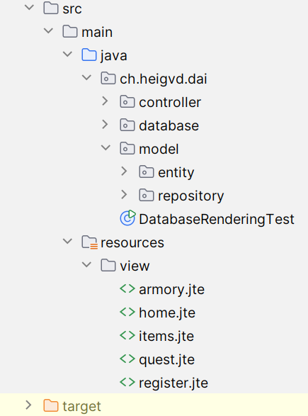

# MMO Project

>Auteurs: Changanaqui Yoann & Duruz Florian

## Get Started

Suivez toutes ces étapes pour avoir notre application fonctionnelle.

### Using docker

1. Clonez le repository sur [GitHub](https://github.com/Yoy017/DAI-Practical-work-3-Duruz-Changanaqui.git) (pour récupérer les fichiers .sql et vues nécessaires).

   ```sh
   git clone https://github.com/Yoy017/DAI-Practical-work-3-Duruz-Changanaqui.git
   ```
   
*Cette étape permet de récupéré le fichier docker-compose.yml*

2. Récupérer l'image de l'application.

   ```sh
   docker pull ghcr.io/yoy017/mmo-project:latest
   ```

3. Utilisez le fichier **docker-compose.yml** pour démarrer les services de l'application et de la base de données PostgreSQL (depuis la racine du projet).

   ```sh
   # Si pas déjà fait, créer le réseau Docker
   docker network create web
   
   docker compose up -d
   ```
   
Vous pouvez désormais accéder à la page d'accueil de l'application depuis [mmoproject.duckdns.org/](https://mmoproject.duckdns.org/).

### Manual Installation

1. Clonez le repository sur [GitHub](https://github.com/Yoy017/DAI-Practical-work-3-Duruz-Changanaqui.git).

   ```sh
   git clone https://github.com/Yoy017/DAI-Practical-work-3-Duruz-Changanaqui.git
   ```

2. Importez la BDD en suivant l'ordre d'exécution des scripts suivant (les scripts se retrouvent dans /BDR/scripts/*.sql) :

    - **create_database.sql** *(éventuellement **delete.sql** si la base de données existe déjà)*
    - **insert.sql**
    - **Trigger.sql**
    - **View.sql**

3. Démarrez le serveur PostgreSQL.

   ```sh
   docker compose -f postgre-sql-server.yml up
   ```

4. Démarrez l'application.

   ```sh
   # Package l'application
   ./mvnw package

   # Exécute l'application
   java -jar target/MMO_Project-1.0-SNAPSHOT.jar
   ```

Maintenant l'application tourne ainsi que le serveur PostgreSQL. Vous pouvez dorénavant accéder à notre application depuis [localhost:8080](http://localhost:8080).

## Structure des Fichiers

L'application possède la structure suivante en suivant le modèle MVC pour la gestion avec la BDD.


### Controller

- Sert à gérer la logique entre les interactions de l'utilisateur (via l'interface ou des commandes) et les actions associées au modèle.

### Database

- Contient les classes pour la connexion et les interactions avec la base de données PostgreSQL.

### Model

- Représente les données et leur logique métier.

#### Entity

- Définit les classes de données (entités) correspondant aux tables de la base de données.

#### Repository

- Fournit des méthodes pour accéder et manipuler les entités stockées dans la base de données.

Le fichier **Dockerfile** définit l'image Docker utilisée pour exécuter l'application. Déclare la commande pour lancer le programme Java.

Le fichier **docker-compose.yml** configure le service PostgreSQL utilisé pour la base de données, en définissant les variables d'environnement, les ports d'accès, et le réseau Docker pour permettre la communication entre les services.

## Application protocol interface (API)

Vous pouvez retrouver la description de notre API dans le fichier [api.md](./api.md).

## Virtual Machine Setup

Configurons la machine virtuelle pour héberger votre application.

1. Connectez-vous au [portail Azure](https://portal.azure.com/) et créez une nouvelle machine virtuelle avec les configurations suivantes :
    - **Resource Group** : Créez un nouveau groupe de ressources ou utilisez-en un existant.
    - **Nom de la Machine Virtuelle** : Choisissez un nom pour votre VM.
    - **Région** : Sélectionnez une région proche de votre public cible.
    - **Image** : Ubuntu Server 20.04 LTS.
    - **Taille** : Standard B1s (ou une autre taille adaptée à vos besoins).
    - **Type d'Authentification** : Clé SSH publique.
    - **Nom d'utilisateur** : Définissez un nom d'utilisateur pour la connexion.
    - **Clé SSH Publique** : Ajoutez votre clé publique pour l'accès sécurisé.
    - **Règles des Ports Entrants** : Autorisez les ports 22 (SSH) et 8080 (accès à l'application).

2. Une fois la VM créée, connectez-vous à celle-ci via SSH :

   ```sh
   ssh <votre-utilisateur>@<adresse-ip-publique>
   ```

3. Installez Docker et Docker Compose sur la VM :

   ```sh
   sudo apt update
   sudo apt install -y docker.io docker-compose
   ```

4. Récupérez et lancez l'application comme indiqué [Get Started](#get-started).

Votre application est maintenant en cours d'exécution et accessible via l'adresse IP publique de la VM sur le port 8080 (http://<adresse-ip-publique>:8080).

## DNS Zone Configuration

Configurons notre zone DNS pour accéder à l'application web.

1.Rendez-vous sur le site web de [DuckDNS](https://www.duckdns.org/) et identifier vous.

2.Choisissez un sous-domaine (par exemple, "mmoproject.duckdns.org").


3.Remplacez l'addresse IP qu'on vous a attribué par celle de votre machine virtuelle.

Remplacez "mmoproject.duckdns.org" par votre sous-domaine choisi dans les étiquettes du service Traefik et de l'application.
Ajoutez une tâche cron ou un script pour mettre régulièrement à jour l'adresse IP en utilisant l'URL "Mettre à jour l'IP" copiée.

Cela permettra à votre application d'être accessible via votre sous-domaine DuckDNS. Assurez-vous de tester le domaine après avoir mis à jour la configuration.

| Type | Nom                    | Adresse                 |
|------|------------------------|-------------------------|
| A    | mmoproject.duckdns.org | 20.71.51.140           |


## Examples Using CURL

Voici comment interagir avec notre application à l'aide de `curl` :

### Vérifiez l'état de l'application

```sh
curl -X GET http://mmoproject.duckdns.org/api/status
```

**Réponse attendue :**

```json
{
  "status": "ok",
  "message": "Application is running"
}
```

### Ajouter un utilisateur

```sh
curl -X POST http://mmoproject.duckdns.org/api/users -H "Content-Type: application/json" -d '{"username": "test", "email": "test@example.com"}'
```

**Réponse attendue :**

```json
{
  "id": 1,
  "username": "test",
  "email": "test@example.com"
}
```

## Build and Publish Docker Image

1. Construisez l'image Docker :

   ```sh
   docker build -t mmoproject.duckdns.org/mmo-project:latest .
   ```

2. Publiez l'image sur un registre Docker :

   ```sh
   docker tag mmoproject.duckdns.org/mmo-project:latest ghcr.io/mmoproject.duckdns.org/mmo-project:latest
   docker push ghcr.io/mmoproject.duckdns.org/mmo-project:latest
   ```

Votre application est maintenant prête à être déployée sur n'importe quel serveur prenant en charge Docker !